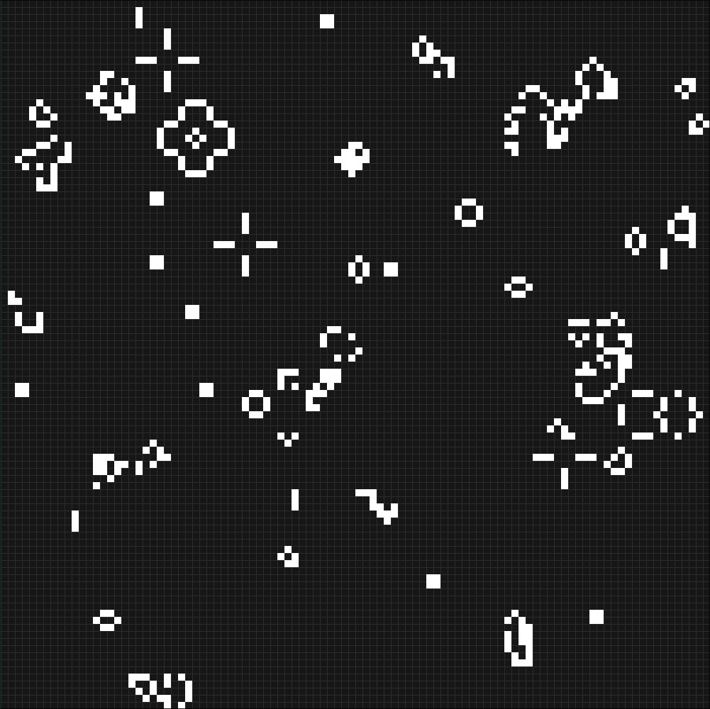

# Conway's Game Of Life





Implementation of Conway's game of life in C using SDL2 to render the simulation.

## Dependencies

- SDL2

## Usage

```bash
make
./game_of_life [random]
```
### Parameters

- random: Generate random starting simulation


## Controls

- Space: Pause/Resume simulation
- Click: Toggle cell state

## References

- [Conway's Game of Life](https://en.wikipedia.org/wiki/Conway%27s_Game_of_Life)
- [sdl-grid](https://github.com/catsocks/sdl-grid)

